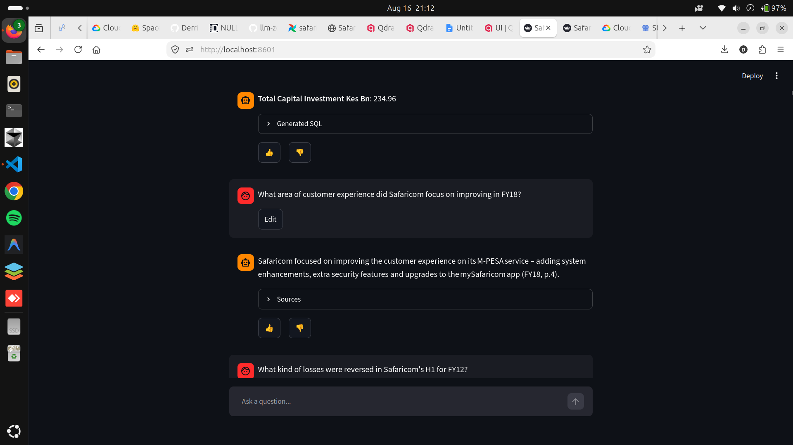
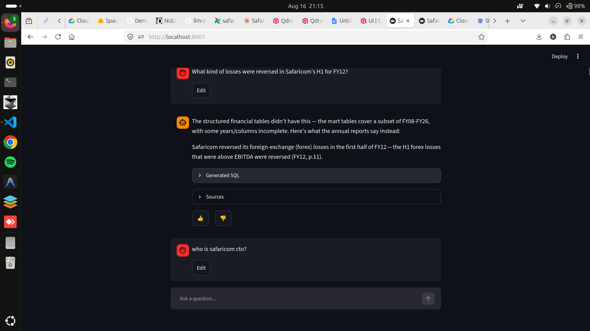
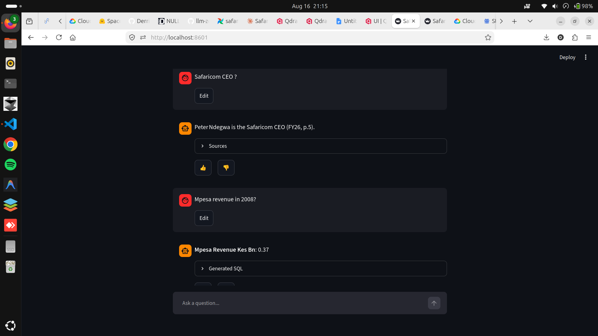
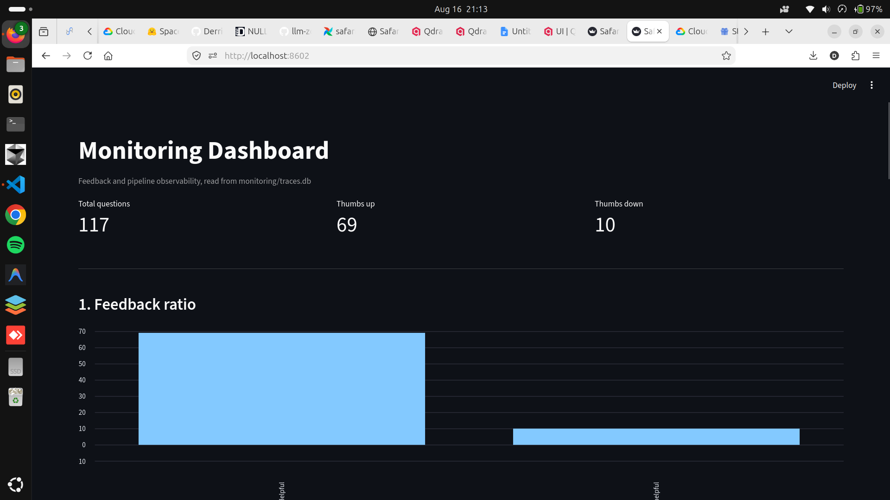
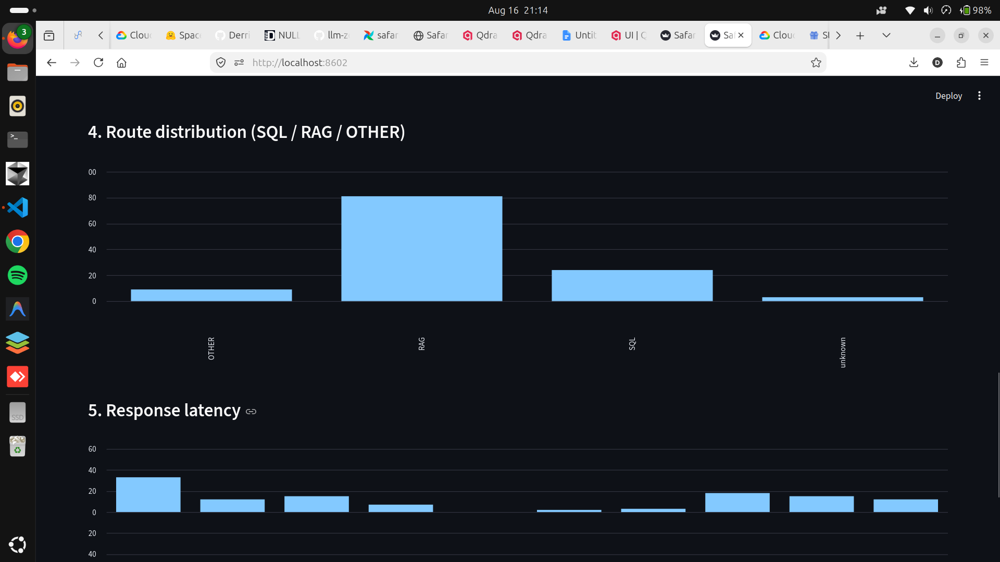
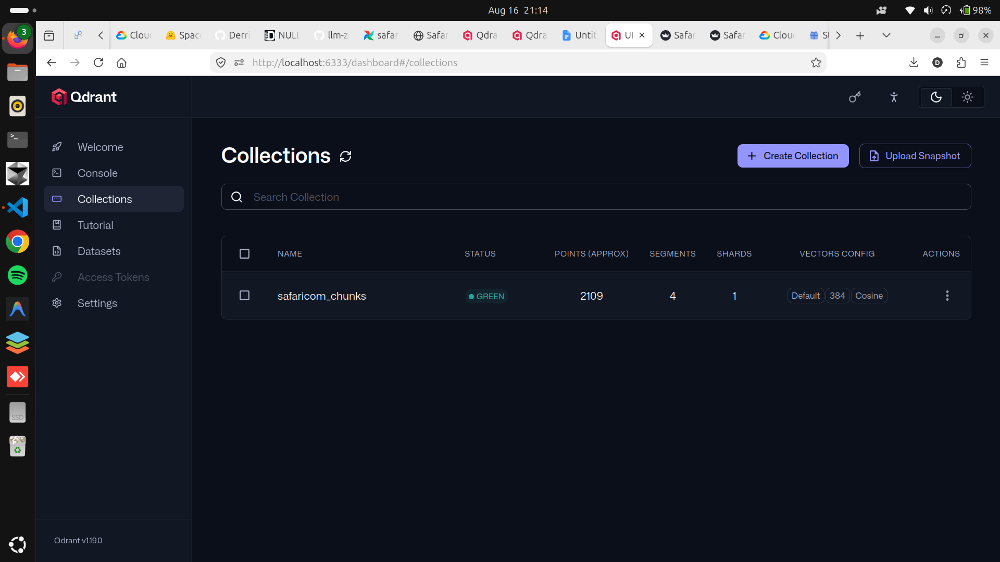

# Safaricom Financial Intelligence Assistant

A conversational assistant over Safaricom PLC's financial history: SQL
against BigQuery mart tables for structured questions, hybrid RAG over 19
years of annual report PDFs for narrative ones, and a live web search
fallback for anything neither source covers. A capstone project for LLM
Zoomcamp 2026.

## Table of Contents

- [Problem Description](#problem-description)
- [Solution Overview](#solution-overview)
- [Architecture](#architecture)
- [Tech Stack](#tech-stack)
- [Data Sources](#data-sources)
- [Data Acquisition](#data-acquisition)
- [Project Structure](#project-structure)
- [Data Quality: What Broke and How It Was Found](#data-quality-what-broke-and-how-it-was-found)
- [Evaluation](#evaluation)
- [Known Limitations](#known-limitations)
- [Live Demo](#live-demo)
- [Screenshots](#screenshots)
- [Credentials Required to Run](#credentials-required-to-run)
- [Reproducibility: How to Run](#reproducibility-how-to-run)

## Problem Description

Safaricom PLC has published financial results for every fiscal year since
2008, but that history lives in two disconnected forms. Structured metrics
(revenue, EBITDA, M-PESA growth) sit in BigQuery tables built from
hand-curated data, useful for trend analysis but blind to the *why* behind
the numbers. The *why*, strategic commentary, competitive context, one-off
explanations, is locked inside 19 years of PDF annual reports and results
presentations, effectively unsearchable beyond manually opening each file.

Answering "How did M-PESA revenue grow in FY19, and what drove it?" today
means separately querying a table for the number and skimming a 100+ page
PDF for the explanation, with no way to ask both in one place, and no way
to search across 19 years of history at once. And for anything genuinely
outside both sources, the honest answer has always been "go look it up
somewhere else."

This project builds a single conversational assistant that closes all
three gaps from one interface.

## Solution Overview

| Dimension | Detail |
|---|---|
| Scope | FY08 through FY26, 19 fiscal years of Safaricom annual reports, press commentaries, and results/earnings booklets |
| Structured data | BigQuery mart tables (`mart_ke_et_trajectory`, `mart_mpesa_growth_trends`, `mart_revenue_mix`), built in a separate dbt project |
| Unstructured data | ~2,100 chunks extracted from 19 PDFs, embedded and indexed for hybrid search |
| Fallback | Live web search when neither internal source has enough to answer, clearly labeled as unverified against a primary source |
| Interface | Streamlit chat, source citations linked directly to the source PDF, session-isolated conversation history, thumbs up/down feedback |
| Orchestration | Airflow DAG with dynamic task mapping, one extract/chunk/embed cycle per discovered PDF |
| Deployment | Containerized on Google Cloud Run, scales to zero |

Key questions this answers:

- What was M-PESA revenue in a specific fiscal year, and how did it compare
  to the year before? (SQL path)
- What factors drove a specific metric's growth or decline, based on
  Safaricom's own stated commentary? (RAG path, cited by fiscal year and
  page number, linked to the original PDF)
- Anything current-events-adjacent or outside the PDF corpus entirely,
  answered via live search, explicitly flagged as not verified against a
  primary source.

## Architecture

```
Safaricom Annual Report PDFs (19 documents, FY08-FY26)
        |
unstructured[pdf] extraction (hi_res + table structure inference,
Tesseract OCR)
        |
Chunking (500 tokens, 50 overlap, sentence-boundary-aware)
        |
ONNX embeddings (all-MiniLM-L6-v2, 384-dim, CPU-only)
        |
Fiscal year normalized to one canonical form at load time -- the raw
corpus spells the same year multiple ways depending on source
document (e.g. "FY_8" and "FY8" both exist for FY2008)
        |
LLM Router (SQL vs narrative vs neither)
    |
    +-- SQL questions --> BigQuery: generated SQL, validated against
    |                     the live schema before running (rejects
    |                     hallucinated table/column references) --
    |                     mart_ke_et_trajectory, mart_mpesa_growth_
    |                     trends, mart_revenue_mix
    |
    +-- Narrative questions --> hybrid search (minsearch keyword +
    |                           Qdrant vector, Reciprocal Rank
    |                           Fusion weighted toward keyword
    |                           matches, optional fiscal-year
    |                           filter) --> top-20 candidates -->
    |                           cross-encoder reranking --> top-10
    |                           --> LLM generation, cited by fiscal
    |                           year and page number, source panel
    |                           links directly to the original PDF
    |
    +-- Neither has enough --> live web search fallback, answer
                                explicitly labeled as unverified
                                against a primary source
        |
Streamlit chat interface -- conversation history isolated per
browser session (Firestore-backed, survives container restarts),
OpenTelemetry tracing, thumbs up/down feedback, feedback dashboard
        |
Deployed on Google Cloud Run, scales to zero
```

Ingestion (extract -> chunk -> embed -> refresh BigQuery -> upload to GCS)
runs as an Airflow DAG (`safaricom_ingestion`) with dynamic task mapping
over discovered PDFs, containerized via Docker Compose (Postgres +
LocalExecutor, deliberately not Celery, since this is a batch pipeline run
manually when a new results announcement drops, not a high-throughput
production system).

## Tech Stack

| Layer | Tool | Purpose |
|---|---|---|
| LLM | Groq (`openai/gpt-oss-120b`) | RAG generation, SQL generation, web fallback synthesis |
| LLM (lightweight tasks) | Groq (`openai/gpt-oss-20b`) | Router classification and answer judging -- higher free-tier TPM budget than the 120b model, and neither task needs the larger model's reasoning depth |
| Embeddings | ONNX Runtime, `Xenova/all-MiniLM-L6-v2` | 384-dim, CPU-only, avoids a ~2GB CUDA PyTorch pull for a project with no GPU |
| Reranking | fastembed cross-encoder, `Xenova/ms-marco-MiniLM-L-6-v2` | Reorders the top-20 RRF-fused candidates by actual query relevance before generation -- RRF rank and true relevance aren't the same thing |
| Vector search | Qdrant | Cosine distance, HNSW; local Docker instance for development, Qdrant Cloud for the deployed app |
| Keyword search | minsearch | Combined with vector search via alpha-weighted Reciprocal Rank Fusion |
| PDF extraction | `unstructured[pdf]` | `hi_res` strategy, table structure inference, Tesseract OCR |
| Structured data | BigQuery | Mart tables (separate dbt project) plus a refreshed chunks/embeddings table for the RAG side |
| Web fallback | `duckduckgo_search` (DDGS) | No API key required |
| Orchestration | Apache Airflow | LocalExecutor, Docker Compose, dynamic task mapping |
| Interface | Streamlit | Chat UI plus a separate feedback dashboard |
| Conversation persistence | Firestore | Session-isolated chat history (session ID in the URL), survives Cloud Run cold starts and container recycling -- a local SQLite file, used earlier in development, doesn't survive either |
| Monitoring | OpenTelemetry | Custom SQLite span exporter (no collector needed at this scale) |
| Secrets | GCP Secret Manager | Only `GOOGLE_APPLICATION_CREDENTIALS` and `GCP_PROJECT_ID` in `.env` |
| Deployment | Google Cloud Run | Containerized, serverless, `min-instances=0` -- $0/month at personal-demo traffic levels |
| Package management | uv | All dependency versions pinned via `uv.lock` |

## Data Sources

19 unique fiscal years, sourced directly from Safaricom's investor
relations materials. Naming conventions changed several times across the
18-year span, which mattered more than expected, see the data quality
section below.

| Era | Format | Fiscal Years |
|---|---|---|
| Earliest history | Investor presentations, narrative/slide-deck format | FY08, FY10, FY11, FY12, FY13, FY14 |
| Press commentaries | Narrative prose, headline figures embedded in text | FY09, FY15 through FY19 |
| Results/earnings booklets | Structured template, tables and segment detail | FY20 through FY26 |

## Data Acquisition

There are two ways to work with this project, depending on what you need.

**Just want to run retrieval, evaluation, or inspect the data?** Nothing
to download. `embeddings/*.jsonl` (19 files, one per PDF, ~2,100 chunks
with 384-dim vectors) is committed directly in this repo. Clone and go —
`retrieval/search.py`, `evaluation/metrics.py`, and
`evaluation/answer_quality.py` all read from these files with no GCS
access, no `gsutil`, and no re-running of extraction or embedding.

**Want to run the full pipeline end to end** (extraction, chunking,
embedding from raw PDFs, e.g. after fixing a data issue or adding a new
year's report)? Pull the source PDFs first — they aren't committed here,
since 19 PDFs directly in git history would permanently bloat every
future clone:

    mkdir -p raw
    gsutil -m cp "gs://safaricom-rag/raw/*.pdf" raw/

Full instructions, including the original Safaricom source as fallback,
are in [DATA.md](./DATA.md).

Note: the SQL path depends on BigQuery mart tables built by a separate
dbt project, not by this repo. Cloning this repo does not populate those
tables regardless of which path above you take; the RAG and web-fallback
paths do not need them. See [DATA.md](./DATA.md) for detail.

## Project Structure

```
safaricom-financial-rag/
├── config.py                      # loads secrets from GCP Secret Manager
├── main.py
├── ingestion/
│   ├── extract.py                 # unstructured PDF extraction
│   ├── verify_fiscal_years.py     # cross-checks filename vs document content
│   ├── fix_fiscal_years.py        # corrects mislabeled fiscal_year/title fields
│   ├── chunk.py                   # 500 tokens, 50 overlap, sentence-aware
│   ├── embed.py                   # ONNX embeddings
│   ├── upload_gcs.py              # raw PDFs + processed JSONL to GCS
│   └── upload_to_bigquery.py      # chunks + embeddings to BigQuery
├── retrieval/
│   ├── search.py                  # hybrid search: minsearch + Qdrant + alpha-weighted RRF, fiscal-year normalization/filtering
│   ├── rerank.py                  # cross-encoder reranking of retrieved candidates
│   ├── router.py                  # LLM classification: SQL vs RAG
│   ├── sql_query.py               # BigQuery SQL generation, schema validation, execution
│   ├── rag.py                     # hybrid search + reranking + LLM generation
│   ├── web_fallback.py            # live web search when internal sources
│   │                                 come up short
│   └── check_rank.py              # retrieval debugging: where does a known
│                                     chunk actually rank for a given query
├── evaluation/
│   ├── ground_truth.py            # resumable Q&A pair generation with
│   │                                 reference answers
│   ├── curate_ground_truth.py     # dedup + year-stratified sampling
│   ├── metrics.py                 # Hit Rate, MRR at configurable k
│   ├── tune_alpha.py              # grid-search RRF keyword/vector weighting
│   ├── answer_quality.py          # LLM-as-judge against reference answers
│   ├── check_refusals.py          # separates honest refusals from actual
│   │                                 wrong answers
│   ├── compare_verdicts.py        # diffs judge verdicts across iterations
│   ├── sql_ground_truth.py        # ground truth for the SQL path
│   ├── sql_eval.py                # SQL path accuracy evaluation
│   └── mart_completeness_check.py # confirms mart table schema/coverage
│                                     assumptions before trusting them
├── monitoring/
│   ├── tracer.py                  # OpenTelemetry + SQLite span exporter
│   ├── feedback.py                # thumbs up/down capture
│   ├── conversation_store.py      # Firestore-backed, session-isolated chat history
│   └── dashboard.py                # Streamlit feedback dashboard
├── ui/
│   └── app.py                     # Streamlit chat interface
├── airflow/
│   ├── dags/ingestion_dag.py      # discover_pdfs -> extract/chunk/embed
│   │                                 (dynamic task mapping) -> refresh
│   │                                 BigQuery -> upload to GCS
│   ├── Dockerfile
│   └── docker-compose.yml         # Postgres + LocalExecutor
├── docker/
│   └── Dockerfile
├── models/Xenova/all-MiniLM-L6-v2/  # cached ONNX model + tokenizer
├── config.py, pyproject.toml, uv.lock
└── .env.example
```

## Data Quality: What Broke and How It Was Found

**Fiscal years were mislabeled for five documents, and the pattern was
inconsistent enough to need content-based verification, not just filename
parsing.** Safaricom's own filenames use different conventions across
eras: some use the starting calendar year of a fiscal year span
(`FY14-15Press_Commentary.pdf`), some use the ending year, some use
2-digit, some 4-digit, and at least one 2008-era file used a single digit
(`FY_8Results...`). Trusting the filename alone got it wrong in five
cases, most notably `FY14-15Press_Commentary.pdf`, `FY15-16Press_
Commentary.pdf`, and `FY16-17Press_Commentary.pdf`, which are actually
FY15, FY16, and FY17 respectively: each document's own "YEAR ENDED"
statement contradicts what its filename implies. `verify_fiscal_years.py`
checks every document's content against its filename-derived label;
`fix_fiscal_years.py` corrects the ones that disagree, leaving anything
unverifiable untouched rather than guessing.

**Even after that fix, the `fiscal_year` field itself wasn't spelled
consistently across the corpus, which stayed hidden until a filtering
feature actually depended on it.** Different source documents encoded the
same year differently: `FY_8` and `FY8` both exist for FY2008, `FY_20` and
`FY20` both exist for FY2020 — an underscore-presence and zero-padding
inconsistency, not a wrong-year mistake like the five documents above. An
exact-match filter (fiscal-year-scoped retrieval, added later) would
silently return zero chunks for whichever spelling it didn't happen to
check, without erroring — the kind of bug that looks like "no results for
this year" rather than an obvious crash. `normalize_fiscal_year()`
collapses every variant to one canonical `FYn` string via `year % 100`
(handles 1-4 digit input, with or without a leading underscore,
identically), applied uniformly at load time so retrieval, filtering, and
the model's own citations always agree on the same spelling.

Because `chunk_id` is a freshly generated UUID on every chunking run,
correcting an already-processed document's fiscal year meant more than a
metadata patch: it meant re-chunking (new IDs), re-embedding, purging the
now-orphaned old chunk IDs from the ground truth set, and regenerating
ground truth for just those documents. The `evaluation/ground_truth.py`
pipeline was built resumable specifically because of this: any interrupted
or partially-invalidated run can restart and pick up only what's actually
missing, tracked by which `chunk_id`s already appear in the output file.

**Reciprocal Rank Fusion needed a real BigQuery client library fix, not a
prompt tweak.** `qdrant-client` 1.18+ removed `.search()` entirely in favor
of `.query_points()`, with a renamed `query=` parameter and a response
object wrapping results in `.points` instead of returning them directly. A
version mismatch, not a logic bug: this only showed up the first time
hybrid search actually ran against real data.

**Qdrant Cloud enforces a rule a local Qdrant instance doesn't: filtering
on a payload field requires an explicit index for that field to exist
first.** Fiscal-year-filtered queries worked fine locally but threw a 400
("Index required but not found for fiscal_year") the first time the same
code ran against the deployed app's Qdrant Cloud cluster — same query,
genuinely different server-enforced behavior between a self-hosted
instance and the managed Cloud tier. Fixed by creating the payload index
explicitly (`create_payload_index`, `keyword` type) as part of collection
setup, so any future delete-and-reseed of the collection — local or
Cloud — gets it automatically rather than requiring a one-off manual fix
again.

**Generated SQL failed with "must be qualified with a dataset" on the very
first real query**, because the LLM was given bare table names in its
schema context but BigQuery's client needs either a fully-qualified
`project.dataset.table` reference or a default dataset set on the query
job itself. Fixed by setting `default_dataset` on the `QueryJobConfig`
rather than hoping the model always writes fully-qualified names. Separately,
four of the seven mart tables named in the original project plan
(`stg_company_overview`, `stg_kenya_ethiopia`, `stg_mpesa_metrics`,
`stg_revenue_segments`) turned out not to exist under those names in
`dbt_rgiggs_mart` at all, confirmed via `bq ls` rather than assumed;
`sql_query.py`'s schema introspection was trimmed to the three tables that
actually exist. A live case of the SQL path substituting a real-but-wrong
column for one that didn't exist (a total/aggregate figure standing in for
a question about a specific narrower category) led to two further
safeguards: a schema-validation guard that rejects any generated SQL
referencing a table/column not in the live introspected schema, and a
system-prompt instruction telling the model explicitly not to substitute
a broader column when the specific one it needs isn't available — the
schema guard alone doesn't catch that case, since the substituted column
was real, just the wrong one.

**The headline answer-quality number looked much worse than the system
actually performed, until refusals were separated from wrong answers.**
Early LLM-as-judge runs reported roughly a third of answers as "relevant,"
which sounds mediocre until you notice that most of the "not relevant"
verdicts were the model honestly declining to answer when retrieval hadn't
surfaced enough evidence, not the model getting something wrong. A
regex-based refusal detector (`check_refusals.py`) initially undercounted
these too: phrasings like "do not contain information about" (missing
"enough"), "no information...about" with extra words in between, and "do
not mention" (plural, vs. the singular "does not mention" the first
version matched) all slipped through as if they were substantive wrong
answers. Broadening the detector and re-splitting the results (no new LLM
calls needed, since the underlying answers were already generated) showed
the real picture: the model refuses roughly a third of the time when it
genuinely lacks evidence, and is right or partly right about 97% of the
time when it actually attempts an answer. See [Evaluation](#evaluation)
for the numbers.

**A handful of ground-truth question/answer pairs were simply wrong**,
caught by manually reading through failure cases rather than trusting
verdicts blindly. One question, "Who are the owners of Safaricom?",
carried a generated reference answer of "ESSAR Communications", a phrase
that actually describes a *competitor* in a "Competitive Landscape"
section of the source document, not Safaricom's own ownership. The
question-generation LLM had misattributed a fact from the same chunk to
the wrong entity. A recurring, lower-severity pattern: several fiscal
years share near-identical boilerplate phrases (e.g. "Strong financial and
commercial performance" appears in FY15 through FY18 alike), so questions
generated from one year's occurrence of common phrasing have no single
correct year to retrieve, a structural ambiguity in the ground truth
itself, not a retrieval failure. The same boilerplate-reuse pattern shows
up again at the retrieval-quality level, see Known Limitations below.

## Evaluation

**Retrieval** (Hit Rate / MRR). Two benchmarks exist so far, not directly
comparable to each other — see note below:

*500-question benchmark (`ground_truth_curated_v1.jsonl`, curated from
6,222 candidates, stratified across all 19 fiscal years), pre-tuning
default weighting:*

| k | Hit Rate | MRR |
|---|---|---|
| 2 | 0.47 | 0.421 |
| 5 | 0.61 | 0.4625 |
| 10 | 0.696 | 0.4763 |

*1,000-question benchmark (`ground_truth_curated_v2.jsonl`, same
year-stratified curation process at a larger target size), α=0.6 (current
default):*

| k | Hit Rate | MRR |
|---|---|---|
| 2 | 0.454 | 0.402 |
| 5 | 0.572 | 0.4362 |
| 10 | 0.652 | 0.4486 |

k=10 corresponds to how many chunks are actually passed to generation
post-rerank in production (`num_results=10` default) — not k=5 as an
earlier version of this table said, which was written before reranking
existed.

The second benchmark's numbers are lower than the first's across every k.
This is **not** read as "alpha tuning or reranking made retrieval worse"
— the two runs differ in benchmark size and (likely) composition, not
just in pipeline config, and `curated_v1.jsonl` no longer exists in this
repo to re-run for a clean controlled comparison. A true before/after on
the *same* question set is a known gap, not something these two tables
answer.

**RRF fusion weighting was tuned and confirmed separately**, using the
full 6,219-row raw ground truth set (pre-curation, larger and noisier than
either benchmark above) at k=20 — matching the width of the candidate
pool retrieval actually hands to the reranker in production.
Grid-searching keyword-vs-vector weight (`alpha`) across
`{0.3, 0.4, 0.5, 0.6, 0.7}` found **alpha=0.6 best on both Hit Rate@20
(0.7086) and MRR (0.4354)**, narrowly ahead of the previous unweighted 0.5
default; 0.3 and 0.4 were clearly worse and ruled out. This is now the
default in `hybrid_search()`.

**Candidate-pool ceiling**: running the 1,000-question benchmark at wider
k values shows Hit Rate still climbing well past production's actual
candidate width — 0.652 at k=10, 0.747 at k=30, 0.771 at k=40, 0.782 at
k=50 — while MRR is essentially flat over the same range (0.4486 → 0.4552).
This isn't a sign the wider-k results are somehow "wrong": MRR only
rewards *how early* a correct chunk appears, so a hit newly found at
rank 35 contributes almost nothing (`1/35`) to an average already near
0.45, even though it's a real hit. Reranking can only reorder whatever
`hybrid_search()`'s candidate pool already contains (`num_results*2=20`
by default) — it cannot retrieve a chunk that never made that pool. The
gap between Hit Rate@10 (0.652) and Hit Rate@30 (0.747) suggests a real
share of questions have their correct chunk sitting just outside the
current 20-candidate window, a ceiling reranking alone cannot fix. Hit
Rate@20 specifically wasn't measured — a cheap, useful next run — before
deciding whether widening `num_results` (e.g. 10→15, a 30-candidate pool)
is worth the added reranking cost.

**Answer quality**, run through the production RAG pipeline over the same
500 questions, judged against reference answers, **prior to this
session's retrieval changes** (alpha tuning, reranking, fiscal-year
filtering): 157 questions (31.4%) are honest refusals, the system
declining rather than guessing when retrieval doesn't surface enough
evidence. Of the 343 questions where the system attempted an answer,
97.1% were judged at least partially correct and 48.7% fully correct,
with only 2.9% genuinely wrong.

A fresh run against the current pipeline (`evaluation/answer_quality_v4.jsonl`,
1,000-question `curated_v2` set) is in progress. Mid-run it surfaced a new
failure mode not present in the original three: for "What was the net
taxation payable in FY23?" (chunk `580c2810-ca27-400d-8e50-1878b52db81e`),
the model confidently cited a number (160,352.0) that almost certainly
belongs to a different line item entirely — the source excerpt is a
cash-flow-statement table where PDF extraction separated row labels from
their numeric values, and none of the numbers actually present in that
excerpt are anywhere near the correct figure. `RAG_SYSTEM_PROMPT` was
tightened to treat an ambiguous label-to-value pairing the same as "not
enough information" rather than guessing the nearest number. Full
pre/post accuracy numbers against this baseline to follow once the v4 run
completes.

**SQL path evaluation and further answer-quality iterations** (a dedicated
ground truth and accuracy harness for the SQL path, plus several
subsequent refinements to the answer-quality methodology) exist in
`evaluation/sql_eval.py`, `sql_ground_truth.py`, and later `answer_
quality_v2` through `v4` result files, built to close the gap where SQL
generation had received no formal evaluation despite real bugs (hallucinated
column names, invalid aggregation syntax) surfacing under live use.
Numbers from these runs aren't reflected above yet, add them here once
finalized.

## Known Limitations

- BigQuery mart tables only cover whatever years exist in the underlying
  seed data from the separate dbt project; SQL questions about years
  outside that range return no results even though the PDF corpus covers
  those years narratively.
- SQL generation has occasionally hallucinated column names or produced
  invalid SQL for complex questions (aggregate/window function mismatches
  in particular). A schema-validation guard now rejects references to
  table/column names that don't exist in the live schema, but it cannot
  catch a *real* column used for the wrong thing (e.g. an aggregate figure
  substituted for a missing narrower one) — that failure mode is addressed
  at the prompt level instead, not fully closed by validation alone. The
  dedicated SQL evaluation harness exists to systematically find and
  prioritize these rather than fixing them one at a time as spotted.
- The web search fallback is intentionally unverified against a primary
  source and says so explicitly in its own answers; treat it as a last
  resort, not a citation-quality source the way the RAG path is.
- `ingestion/upload_to_bigquery.py` loads chunks and embeddings into
  `safaricom_rag.chunks` for archival/inspection, but retrieval itself
  still reads from local `embeddings/*.jsonl`, not from that table. The
  BigQuery chunks table is not yet in the runtime retrieval path.
- The cross-encoder reranker is a generic model (MS-MARCO), not tuned to
  financial-document language. Several fiscal years' reports reuse
  near-identical marketing/boilerplate phrasing (a real characteristic of
  the source filings, not a retrieval bug) that can still occupy multiple
  slots in the same top-10 candidate set, crowding out more substantive,
  differently-worded chunks. A diversity-aware reranking step is a
  plausible future improvement, not yet built or measured against real
  data.
- The pre-rerank candidate pool (top-20) appears to be a real recall
  ceiling, not just the reranker's own limitation — see the
  candidate-pool-ceiling note under Evaluation. Widening it is untested.
- PDF table extraction can separate a table's row labels from its numeric
  values when flattened to text, losing which number belongs to which
  line item (confirmed live for at least one cash-flow-statement excerpt,
  chunk `580c2810-ca27-400d-8e50-1878b52db81e`). `RAG_SYSTEM_PROMPT` now
  instructs the model to treat an ambiguous pairing as insufficient
  information rather than guess, but the underlying extraction issue
  itself is unfixed — worth checking whether other cash-flow tables in
  the corpus show the same pattern before deciding whether to re-extract
  with a table-aware method (e.g. pdfplumber's table mode) for that
  document class.
- Session identity for conversation history is a random ID carried in the
  URL, not a real authentication mechanism — it prevents different
  visitors from *accidentally* sharing one conversation, but a shared or
  guessed link can still reopen someone else's session. Fine for a
  personal demo tool, not a substitute for real auth if this were ever a
  multi-user product.

## Live Demo

Deployed on Google Cloud Run: [rag-app-1003744998459.africa-south1.run.app](https://rag-app-1003744998459.africa-south1.run.app/)

## Screenshots

Reference for what a working run looks like end to end, useful if you hit
a snag reproducing this and want to check what state things should be in.

**Chat app — SQL path and RAG path, side by side.** The SQL router pulls a
number straight from the BigQuery mart tables (`Total Capital Investment
Kes Bn: 234.96`, with generated SQL shown on request); the RAG path
answers from the PDF corpus with a cited source.



**RAG path citing fiscal year and page number**, and correctly declining
to answer from the structured tables when the mart data doesn't cover it,
falling back to the narrative PDFs instead.



**Router correctly splitting a CEO lookup (RAG) from a numeric lookup
(SQL)** in the same session.



**Feedback dashboard** (`monitoring/dashboard.py`), reading from
`monitoring/traces.db`: total questions, thumbs up/down counts, and
feedback ratio from real usage.



**Router distribution and response latency**, same dashboard, further
down the page.



**Qdrant collection populated after a full ingestion run** — `safaricom_chunks`,
2,109 points, 384-dim vectors, cosine distance, `GREEN` status.



## Credentials Required to Run

Running the live app (chat UI, dashboard, Airflow ingestion) requires your
own GCP project and Qdrant instance set up as below. Cloning this repo
alone does not give you these — each person self-hosting needs their own.
This section does not apply if you only want retrieval/evaluation against
the committed `embeddings/*.jsonl` (see
[Data Acquisition](#data-acquisition)) — that path needs no credentials
at all.

**In a local `.env` file** (not committed, see `.env.example`):

| Variable | What it is |
|---|---|
| `GOOGLE_APPLICATION_CREDENTIALS` | Path to a GCP service account JSON key with Secret Manager read access |
| `GCP_PROJECT_ID` | Your GCP project ID (defaults to `safaricom-intelligence` if unset) |
| `QDRANT_HOST` | Qdrant host — defaults to `localhost` for the Dockerized local instance; set to your Qdrant Cloud cluster URL for the hosted setup |
| `QDRANT_PORT` | Defaults to `6333` |
| `QDRANT_API_KEY` | Required if using Qdrant Cloud; unset for a local Docker instance with no auth |
| `QDRANT_HTTPS` | Set to `true` for Qdrant Cloud, defaults to `false` for local |

**In GCP Secret Manager**, under that same project, `config.py` fetches
these by name at import time — all four must exist or the app fails to
start:

| Secret name | What it is |
|---|---|
| `GROQ_API_KEY` | Groq API key (router, RAG generation, SQL generation, web fallback synthesis) |
| `GCS_BUCKET_NAME` | The GCS bucket used for raw PDF / processed JSONL backup |
| `BIGQUERY_DATASET` | Dataset holding the archival `chunks` table |
| `BIGQUERY_MART_DATASET` | Dataset holding the `mart_*` tables the SQL path queries — these tables themselves come from a separate dbt project, not from secrets alone (see [Data Acquisition](#data-acquisition)) |

**For the deployed (Cloud Run) app specifically**, conversation history
additionally requires a Firestore database (Native mode) in the same GCP
project, and the service account needs the `roles/datastore.user` IAM
role. Not required for local development against the Dockerized/local
Qdrant setup below unless you want persistent chat history there too.

## Reproducibility: How to Run

```bash
git clone https://github.com/Derrick-Ryan-Giggs/safaricom-financial-rag.git
cd safaricom-financial-rag
uv sync
```

`embeddings/*.jsonl` is already committed, so retrieval and evaluation
work immediately after `uv sync` — no further data setup needed for
those. Only pull the raw PDFs if you plan to re-run extraction, chunking,
or embedding from scratch (see [Data Acquisition](#data-acquisition)):

```bash
mkdir -p raw
gsutil -m cp "gs://safaricom-rag/raw/*.pdf" raw/
```

Requires a `.env` file with `GOOGLE_APPLICATION_CREDENTIALS` and
`GCP_PROJECT_ID`; all other configuration (API keys, bucket names, dataset
names) loads from GCP Secret Manager at runtime, never hardcoded and never
committed. See [Credentials Required to Run](#credentials-required-to-run)
for the full list.

**Full stack (recommended)** — `docker-compose.yml` lives at the repo
root and brings up Postgres, Airflow, Qdrant, the chat app, and the
feedback dashboard together:
```bash
docker compose up airflow-init
docker compose up
```
- Airflow UI: `http://localhost:8081` — unpause and trigger
  `safaricom_ingestion`; it discovers PDFs and dynamically maps
  extract/chunk/embed tasks per document, then refreshes the BigQuery
  chunks table and uploads to GCS.
- Chat app: `http://localhost:8601`
- Feedback dashboard: `http://localhost:8602`

The `app` and `dashboard` services expect a GCP service account key at
`~/.gcp/safaricom-intelligence-sa.json` on the host (bind-mounted
read-only into the container); adjust that path in `docker-compose.yml`
if your key lives elsewhere.

**Running the chat app or dashboard outside Docker** (e.g. for faster
iteration during development):
```bash
docker compose up qdrant     # search.py needs a reachable Qdrant server
uv run streamlit run ui/app.py
uv run streamlit run monitoring/dashboard.py
```

**Re-running evaluation** (both are resumable; safe to interrupt and
rerun the same command):
```bash
uv run python -m evaluation.ground_truth --chunks "embeddings/*.jsonl" --output evaluation/ground_truth_v1.jsonl
uv run python -m evaluation.curate_ground_truth --input evaluation/ground_truth_v1.jsonl --output evaluation/ground_truth_curated_v1.jsonl --target-size 500
uv run python -m evaluation.metrics --ground-truth evaluation/ground_truth_curated_v1.jsonl --chunks "embeddings/*.jsonl" --k 2 5 10
uv run python -m evaluation.answer_quality --ground-truth evaluation/ground_truth_curated_v1.jsonl --chunks "embeddings/*.jsonl" --output evaluation/answer_quality_v1.jsonl
```

**Re-running the RRF alpha sweep** (grid-searches keyword-vs-vector
weighting; retrieves once per question and reuses that across every alpha
value rather than repeating retrieval per alpha):
```bash
uv run python -m evaluation.tune_alpha --chunks "embeddings/*.jsonl"
```